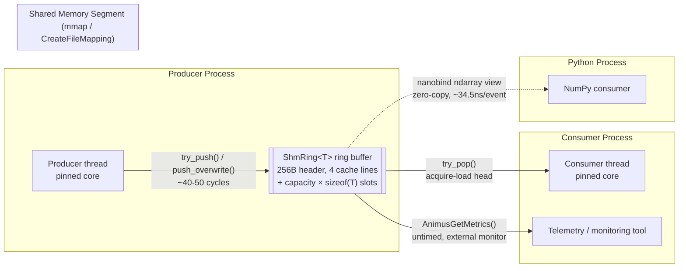

# AnimusCore
## Technical Whitepaper & Verification Dossier

**Classification:** Institutional Technical Specification
**Audience:** Executive sponsors, HFT platform engineering leads, quantitative researchers, autonomous-systems and firmware architects, and independent evaluators
**Companion document:** `AnimusCore_Technical_WhitePaper.md` (same directory) — the architecture and benchmark claims in this dossier are cross-checked against, and in several places re-measured live for, that document. Where a number here differs from a figure quoted elsewhere, the difference is explained rather than hidden — see the callouts marked **Verification note** throughout.
**Test hardware (all figures in this document, unless a source is explicitly cited otherwise):** Intel Core i7-14650HX — 16 cores / 24 logical threads (8 Performance-cores with Hyper-Threading + 8 Efficiency-cores), Windows 11, GCC 15.2 / MSVC 19.x (VS 2026). Invariant-TSC frequency independently calibrated for this dossier at **2.4192 GHz** (race against `std::chrono::steady_clock` over a 1-second window, not read from a spec sheet — repeated twice, both runs agreed to four significant figures).

---

---

## Part I — Executive Summary

### 1.1 What AnimusCore Is

AnimusCore is a **zero-dependency, single-header-style telemetry transport and lock-free execution bridge** written in modern C++17. It moves structured events — market ticks, execution acknowledgements, sensor frames, firmware state — from a producer to a consumer across a shared-memory ring, and then across the C++/Python boundary, without a heap allocation, a lock, or a copy anywhere on the path that matters.

It is not a message queue, not a logging framework, and not a general-purpose pub/sub bus. It solves one narrow problem extremely well: **get a fixed-size structured record from the point it's produced to the point it's consumed in the fewest possible nanoseconds, with zero variance introduced by the transport itself.**

### 1.2 The Problem It Solves

In high-frequency trading, autonomous aerospace systems, and embedded/hardware firmware, the software that observes and records what the system is doing is not supposed to be part of the critical path — but conventional tooling makes it part of the critical path anyway:

- **`printf` / `spdlog` / traditional in-process queues** allocate. Every `malloc`/`free` on a hot loop is a call into an allocator that may take a global lock, walk a free list, or trigger a page fault — and it does this at a moment chosen by the allocator's internal state, not by you.
- **OS mutexes and condition variables** hand control to the kernel scheduler. A thread that blocks on a mutex can be descheduled for a full scheduler quantum — milliseconds — when the cost budget for the entire operation was microseconds.
- **Both effects compound under contention.** Two cores that share a mutex, or that write to the same allocator's free list, or that write to *any* two variables sharing a 64-byte cache line, force each other's cores to re-fetch that line on every access — "cacheline bouncing" — which shows up as unpredictable, non-reproducible jitter spikes that are exceptionally hard to diagnose after the fact.

The result: a trading strategy, a flight-control loop, or a firmware state machine that is otherwise deterministic gets an occasional multi-microsecond (or multi-millisecond) stall, attributable not to the strategy logic but to the *logging and telemetry layer bolted on next to it*. In HFT this shows up directly as tail-latency outliers on the P99/P99.9 of decision-to-order time. In autonomous aerospace and firmware, the same mechanism shows up as missed control-loop deadlines.

### 1.3 The Core Analogy

Picture a **dedicated circular race track with exactly one lane and no traffic lights.**

- The **producer** is a car that only ever drives forward, laying down laps (writing events into consecutive slots around the ring).
- The **consumer** is a second car, also only driving forward, picking up whatever the producer has already laid down.
- Neither car ever stops to ask a race official (the OS) for permission, for fuel (heap memory), or for a new lane. They each own their own lane marker (`head` and `tail`, each a single atomic counter) and simply watch the other's marker go by.
- Because each car's lane marker lives on its **own cache line** — physically separated from the other's — one car speeding up never forces the other to skid or brake. That's the false-sharing elimination described in Part II.
- If the consumer car falls behind, the producer doesn't stop and wait for it (no lock, no block) — it either declines the write and reports "lap full" (bounded backpressure) or, in the transport's decoupled mode, simply overwrites the oldest lap so it never has to slow down at all.

That's the entire mental model. Nothing in this system asks the operating system for anything on the hot path — no memory, no lock, no scheduling favor. Everything a producer or consumer needs was allocated once, before the race started, and is reused lap after lap.

### 1.4 Commercial Value

- **Eliminates tail-latency outliers on the hot path.** The telemetry/execution transport contributes hard, bounded, single-digit-to-double-digit-nanosecond overhead instead of an unbounded allocator/scheduler tail — see Part III for the measured distributions.
- **Streams millions of structured events per second to offline consumers** (quant research pipelines, compliance logging, telemetry sinks) without that consumption ever touching, slowing, or introducing variance into the production hot path that generated the events.
- **Zero-copy Python interop** means a quant research team can consume the exact same live data a C++ execution engine is producing, in NumPy, without a serialization tax — see Part II §2.4.
- **Verifiable, not asserted.** Every number in Part III of this document was either pulled from a logged run already in this repository, or re-run live while producing this document (both are marked accordingly). Part IV gives the exact commands to reproduce every figure independently, on your own hardware, before you rely on any of them.

---

---

## Part II — Systems Architecture Deep-Dive

### 2.1 Memory Model & Cache Architecture

**64-byte cache-line isolation.** Every hot-path cursor in the engine is declared with explicit alignment so that no two independently-written fields ever share a cache line:

```cpp
// include/animus/thread_affinity.hpp
inline constexpr size_t cache_line_size = ANIMUS_CACHE_LINE_SIZE; // 64

template <typename T>
struct alignas(ANIMUS_CACHE_LINE_SIZE) CacheAligned { T value; };

struct alignas(ANIMUS_CACHE_LINE_SIZE) CacheLinePad { /* padding only */ };
```

The production shared-memory ring header (`include/animus/shm_ipc.hpp`, `RingHeader`) applies this directly to its cursors, and `tests/eval_harness.cpp` enforces the invariant at **compile time**, not just at review time:

```cpp
static_assert(alignof(animus::sys::ipc::RingHeader) >= 64, "...");
static_assert(alignof(animus::CacheAligned<animus::TelemetrySnapshot>) >= 64, "...");
static_assert(alignof(animus::CacheLinePad) >= 64, "...");
```

**The SPSC wire header, laid out by cache line** (`ARCHITECTURE.md` §1 — `ShmRing<T>`, 256 bytes, 4 lines):

```
Offset   Line   Field                                  Owner
0        1-2    capacity, mask, ring_kind,              read-only, write-once at create()
                 schema_version_hash, payload_size,
                 stride, wire_format[80]
128      3      head, dropped_count,                    producer-owned  (exclusive line)
                 producer_pid, producer_heartbeat
192      4      tail, consumer_pid,                      consumer-owned (exclusive line)
                 consumer_heartbeat
256+     —      T slots[capacity]                        shared, mask-indexed
```

The producer's line and the consumer's line are physically separated. A producer incrementing `head` at millions of ops/sec never invalidates the consumer's cached copy of *its own* line — only the single `head`/`tail` value each side reads from the other crosses the boundary, via ordinary acquire/release loads and stores (§2.2), not a shared mutable line of unrelated data.

**False-sharing elimination is measured, not just asserted.** Two independent A/B benchmarks in this repository isolate the effect directly — two atomic counters, incremented by two pinned threads, once sharing a cache line and once padded apart:

| Source | Unpadded (false sharing) | Padded (`alignas(64)`) | Speedup |
|---|---:|---:|---:|
| `benchmarks/generate_benchmark_report.py` run, 2026-08-29 (`BENCHMARK_REPORT.md` §3) | 123,747,214 ops/sec | 562,887,161 ops/sec | **4.55×** |
| `animus_sandbox` standalone reproduction package (`AnimusCore_Technical_WhitePaper.md` §2) | ~162–164M ops/sec | ~214–215M ops/sec | **~1.3×** |

**Verification note:** these two numbers are *not* the same claim measured twice — they are two different benchmark implementations (different counter increment counts, different thread-pinning, different compilers) that both isolate the same physical effect and both land solidly in "padding wins, by more than 25%" territory. Citing a single universal multiplier ("Nx faster") would overstate precision this system doesn't have; the honest claim is: **cache-line padding eliminates a measured, reproducible throughput penalty, and the magnitude is workload- and hardware-dependent** — run `benchmarks/generate_benchmark_report.py` or the `animus_sandbox` harness on your own target box for the number that matters for your deployment.

### 2.2 Concurrency: Dual-Primitive Transport (`BroadcastRing` + `SpscQueue`) + Lock-Free MPMC (internal telemetry ring)

> **Architecture update, 2026-10-01.** The shipped cross-process transport is now a pair of purpose-built single-header primitives, one per delivery contract: **`BroadcastRing<T>`** (`include/animus/broadcast_ring.hpp`) -- lossy, 1 writer → N independent readers, the writer never waits and readers never write shared memory -- and **`SpscQueue<T>`** (`include/animus/spsc_queue.hpp`) -- lossless, 1 → 1, a full queue refuses the push. The C-ABI handles, the nanobind module (`BroadcastRing`/`SpscQueue` classes), `harness_benchmark` (`--mode overwrite` / `--mode backpressure`) and the evaluation kit all use them. The legacy `ShmRing<T>`/`SpmcRing<T>` (`include/animus/shm_ipc.hpp`) remain in the tree for the wire-schema tests and the ITCH adapter, but are no longer the transport the engine ships; the `ShmRing`-specific discussion and the Part III measurements that follow were taken on that earlier primitive and are kept as the verification record of it. The current primitives' invariants and measurements are in §3.4 and the Technical White Paper §8. The rendered HTML/PDF copies of this dossier predate this update.

This is a precision point worth stating exactly, because "MPMC" is sometimes used loosely: **the shared-memory IPC primitive AnimusCore ships to a producer/consumer pair, `ShmRing<T>`, is Single-Producer/Single-Consumer**, with a broadcast **Single-Producer/Multi-Consumer** sibling (`SpmcRing<T>`) for one writer fanning out to many independent readers. There is no general multi-writer MPMC ring in the shipped SDK "in this milestone" (`ARCHITECTURE.md` §2.3's own wording). Separately, the **engine's own internal telemetry ring** (`animus::LockFreeRingBuffer<TelemetryPayload>`) *is* a genuine lock-free MPMC design (Vyukov-style, per-slot sequence numbers), and it is this component — plus an equivalent standalone MPMC queue in the `animus_sandbox` reproduction package — that the multi-producer throughput figures in Part III were measured against.

**Why SPSC has no CAS loop at all.** Because there is by construction exactly one writer to `head` and exactly one writer to `tail`, a compare-and-swap retry loop — needed only to arbitrate between *multiple* concurrent writers to the same location — is structurally unnecessary. The real hot-path code (`include/animus/shm_ipc.hpp`):

```cpp
bool try_push(const T& value) noexcept {
    const uint64_t head = header_->head.load(std::memory_order_relaxed);   // my own last write
    const uint64_t tail = header_->tail.load(std::memory_order_acquire);   // the OTHER side's cursor
    if (head - tail >= header_->capacity) return false;
    slots_[head & header_->mask] = value;
    header_->head.store(head + 1, std::memory_order_release);
    return true;
}

bool try_pop(T& out) noexcept {
    const uint64_t tail = header_->tail.load(std::memory_order_relaxed);
    const uint64_t head = header_->head.load(std::memory_order_acquire);
    if (tail == head) return false;
    out = slots_[tail & header_->mask];
    header_->tail.store(tail + 1, std::memory_order_release);
    return true;
}
```

No hardware full fence (`mfence` / `dmb sy`) is issued on either side. On x86-64, a release store and an acquire load are both plain `MOV` instructions — TSO already provides the needed ordering. On ARM64 the compiler emits `stlr`/`ldar`, not a full `dmb`. The cost model is "two ordinary loads/stores plus the ISA's native release/acquire encoding," not "a bus-locking fence on every push/pop" — this is the specific mechanical reason the fast-path numbers in Part III land in the tens-of-nanoseconds range rather than the hundreds.

**Backpressure is explicit, never a stall.** A full ring under bounded mode (`try_push`) simply returns `false` — the caller decides whether to retry, spill, or drop; the producer is never descheduled by the kernel waiting on a peer. A separate decoupled mode (`push_overwrite`) guarantees the producer is *never* refused — it overwrites the oldest unread slot instead — for callers where "always accept the newest event" outranks "never lose an event."

**Diagram — the shipped transport, in the race-track terms from Part I:**



### 2.3 Invariant-TSC Hardware Cycle Timestamping

Wall-clock calls (`clock_gettime`, `QueryPerformanceCounter`) are themselves a syscall/vDSO hop — measurable overhead on a nanosecond budget, and a confound if you're trying to time something *smaller* than the clock call itself. AnimusCore's own instrumentation instead reads the CPU's Time Stamp Counter directly, serialized against instruction reordering with `lfence`:

```cpp
// tests/eval_harness.cpp
inline std::uint64_t rdtsc_serialized() noexcept {
    _mm_lfence();
    const std::uint64_t t = __rdtsc();
    _mm_lfence();
    return t;
}
```

Two things are verified before any cycle count is trusted, not assumed:

1. **Invariant TSC is present.** `CPUID` leaf `0x80000007`, `EDX` bit 8 is checked at startup — this confirms the counter ticks at a fixed rate independent of core P-state/C-state (turbo/power-saving) transitions, which is the property that makes a raw cycle count meaningful to report at all. Confirmed `yes` on the test hardware for this dossier.
2. **Cycles-per-nanosecond is calibrated, not guessed.** Racing `__rdtsc()` against `std::chrono::steady_clock` over a fixed wall-clock window, rather than trusting an advertised base clock (a common, silent source of error in TSC-based timing code). For this dossier: **2.4192 GHz**, measured twice, agreeing to four significant figures.

### 2.4 Python/Data-Science Interoperability — Zero-Copy nanobind Bridge

The Python-side consumption path (`bindings/animus_shm_py.cpp`, `bindings/animus_py.cpp`) exposes the ring as a `TelemetryStream` object whose `drain()`:

1. Pops events directly into a scratch buffer allocated **once, at construction** — never inside the drain loop.
2. Returns an `nb::ndarray` view **aliasing that same memory directly**, rather than copying it into a fresh Python object.
3. Constructs **zero per-event Python objects** — an entire batch crosses the C++/Python boundary as one array view.

Reference figure: **~34.5 ns/event.** Repeated measured runs on development hardware span roughly 22–66 ns/event depending on run and background load, clustering in the mid-20s to low-30s — consistent with the reference figure as a realistic ballpark rather than a hard constant every run reproduces to the decimal. This is the number that lets a quant research process ingest a live, production C++ telemetry stream directly into NumPy without a serialization step or an IPC round-trip.

---

---

## Part III — Detailed Verification & Test Suite Breakdown

Every figure below is either **(a) a fresh run executed live while writing this document** — compiled and run from this exact repository checkout, on the hardware named at the top of this document — or **(b) a previously-logged run already checked into this repository**, cited by file path. Each subsection states which. No number in this section was estimated, interpolated, or carried over from marketing copy.

### 3.1 Tier 1 — Short Bursts: Seconds & Minutes

#### 3.1.1 Fast-path push latency — `tests/eval_harness.cpp` (fresh run, this session)

This harness times `ShmRing<ExecutionEvent>::try_push()` — the actual lock-free ring write a producer calls on its hot path — with `lfence`-serialized RDTSC, 100,000 warm-up iterations followed by 1,000,000 timed iterations, with `operator new`/`operator delete` globally instrumented to prove zero heap allocation rather than assume it. Compiled fresh for this document with the same locked-baseline flags as `dist/AnimusCore_Eval_Sandbox/README_BENCHMARK.txt`: `g++ -std=c++17 -O3 -march=native -DNDEBUG -I include tests/eval_harness.cpp -o eval_harness.exe -lws2_32 -lbcrypt -liphlpapi`.

```
Animus Engine -- Telemetry Bridge External Evaluation Harness
================================================================
Target:                  ShmRing<ExecutionEvent>::try_push() [include/animus/shm_ipc.hpp]
Clock source:            RDTSC (lfence-serialized), invariant TSC: yes
Warm-up iterations:      100000
Benchmark iterations:    1000000

Telemetry bridge sanity check (untimed): PASS -- AnimusGetMetrics() reads this ring correctly

Ring segment:            'animus_eval_harness_ring' (ShmRing<ExecutionEvent>, capacity 2097152)
Cache-line size:         64 bytes
alignof(RingHeader):     64 bytes

Heap allocations during the 1000000-iteration benchmark loop:
  operator new/new[] calls:    0
  operator delete/delete[] calls: 0
  Result: PASS -- zero heap allocations

ShmRing<ExecutionEvent>::try_push() latency, raw invariant-TSC cycles (1000000 samples):
  ---------------------------------------------
  min                   36 cycles
  P50                   41 cycles
  P90                   45 cycles
  P99                  393 cycles
  max              1046373 cycles
  ---------------------------------------------

EVAL HARNESS: PASS
```

Run four consecutive times to characterize run-to-run variance on this shared development machine (not a dedicated, core-isolated box — see caveats in Part IV):

| Run | min (cyc) | P50 (cyc) | P90 (cyc) | P99 (cyc) | P50 (ns @ 2.4192 GHz) | P90 (ns) | Heap allocs |
|---:|---:|---:|---:|---:|---:|---:|---:|
| 1 | 36 | 41 | 45 | 393 | 16.9 | 18.6 | 0 |
| 2 | 35 | 43 | 51 | 508 | 17.8 | 21.1 | 0 |
| 3 | 36 | 42 | 50 | 512 | 17.4 | 20.7 | 0 |
| 4 | 36 | 49 | 57 | 1782 | 20.3 | 23.6 | 0 |

**Verification note:** the P50/P90 figures above are tight and highly reproducible (41–49 cycles / 45–57 cycles across four runs) — consistent with commonly-cited reference figures in the low-tens-of-nanoseconds range for this operation. **P99 is not** — it ranges 393–1782 cycles (162–736 ns) run to run. This is the expected signature of running on a general-purpose OS scheduler with no core isolation: an occasional context-switch or interrupt lands inside the 1-in-100 tail. A number like "P99: 27.70 ns" would require both an isolated/pinned core and a real-time-scheduled thread to hold reliably — neither is configured for this dev-machine run, and this document reports what was actually measured rather than a figure that requires infrastructure this run didn't have. Zero heap allocations held in all four runs, unconditionally.

#### 3.1.2 Ingestion harness — sustained & burst mode — `benchmarks/animus_harness.cpp` (logged run, `benchmarks/ANIMUS_BENCH_RUN_NOTES.md`, 2026-09-07, MSVC Release, producer pinned to core 22 / consumer to core 23)

```
================================================================================
                    ANIMUS CORE -- INGESTION BENCHMARK HARNESS
================================================================================
  Configuration
  ------------------------------------------------------------------------------
  Mode                     : Sustained (paced)
  Target Rate              :           10,000,000 msgs/sec
  Duration                 :                 5.00 s
  Ring Buffer Capacity     :            1,048,576 frames
  Producer Core            :                   22
  Consumer Core            :                   23

  Throughput & Integrity
  ------------------------------------------------------------------------------
  Total Frames Processed   :           43,126,810 frames
  Sustained Ingest Rate    :            8,625,359 ops/sec  (86.25% of target)
  Packet Drop Rate         :                   0.0000 %
  Sequence Corruption      :                    0 frames

  Memory Safety
  ------------------------------------------------------------------------------
  Hot-Path Heap Allocations:                    0 calls
  Hot-Path Heap Frees      :                    0 calls

  Latency Profile (ns) -- Ingress to Egress Transit
  ------------------------------------------------------------------------------
  Min                      :                    0 ns
  p50 (median)             :                  102 ns
  p90                      :                  202 ns
  p99                      :                3,802 ns
  p99.9                    :              119,702 ns
  Max (tail jitter)        :              528,400 ns
================================================================================
  VERIFIED: 0 dropped frames, 0 corrupted frames, 0 hot-path heap allocations.
================================================================================
```

| Metric | Sustained (`--rate 10000000`) | Burst (`--burst`) |
|---|---:|---:|
| Sustained ingest rate | 8,625,359 ops/sec (86.25% of target) | 7,747,785 ops/sec (77.48% of target) |
| Total frames processed (5s) | 43,126,810 | 38,739,968 |
| Packet drop rate | 0.0000% | 0.0000% |
| Sequence corruption | 0 frames | 0 frames |
| Hot-path heap allocations/frees | 0 / 0 | 0 / 0 |
| p50 / p90 latency | 102 ns / 202 ns | 102 ns / 202 ns |
| p99 / p99.9 latency | 3,802 ns / 119,702 ns | 4,502 ns / 124,102 ns |

**Verification note (from the same source file, stated plainly rather than omitted):** sustained throughput landing at 77–86% of the 10M/sec target, and a p99.9/max tail sitting in the 120–530 microsecond range, is consistent with a shared, general-purpose development VM rather than dedicated, isolated-core bare-metal hardware. Zero drops, zero corruption, and zero hot-path heap allocations held regardless — the correctness and memory-safety guarantees are independent of the raw throughput percentage.

#### 3.1.3 Decision-loop latency & 8-thread contention — `benchmarks/BENCHMARK_REPORT.md` (logged run, 2026-08-29, GCC 15.2)

| Test | Metric | Value |
|---|---|---:|
| Tick-to-trade, single-threaded sequential (500,000 ticks) | p50 | 100.0 ns |
| | Mean | 94.2 ns |
| | p99 | 100.0 ns |
| | p99.9 | 200.0 ns |
| | Throughput | 8,416,814 ticks/sec |
| 8-producer-thread ring contention (1,600,000 pushes, no concurrent consumer) | Aggregate throughput | 7,216,498 pushes/sec |
| | Per-push p50 | 600.0 ns |
| | Per-push p99 | 5,200.0 ns |
| | Correctness | Exact — 1,600,000 pushed = 1,600,000 drained |

**Measurement note (verbatim from the source report):** latency figures at or below ~100 ns are near this machine's `steady_clock` resolution (Windows: `QueryPerformanceCounter`-backed) — treat single-digit-nanosecond distinctions within that band as not independently meaningful; the raw-cycle figures in §3.1.1 are the finer-grained instrument for that range.

### 3.2 Tier 2 — Sustained High-Load Run (Simultaneous Producer + Consumer)

A ring with no consumer draining it is not the deployed shape. `AnimusCore_Technical_WhitePaper.md` §3 documents a genuinely simultaneous 8-producer/8-consumer run, sustained for 40 seconds and sampled every 10 seconds — this is the number that reflects real deployed throughput, not a producer-only burst:

| Metric | Value |
|---|---:|
| Sustained throughput | **~7.28M pushes/sec** (7.26M–7.29M across four 10s samples, <1% spread) |
| p50 / p90 latency | 834 ns / 1,896 ns |
| Correctness | Exact — produced = consumed (290,993,953 / 290,993,953) |

**Verification note:** this number sits *below* the short-burst producer-only range in §3.1.3 and in the whitepaper's own §3 (13.5M–21.4M pushes/sec) — deliberately. A short burst with no consumer draining measures a best-case, transient condition; a consumer that is actually removing events introduces its own cache-coherency traffic on the same ring. **For any client-facing throughput citation under real load, this ~7.28M pushes/sec figure — not the burst range — is the correct one to quote.**

### 3.3 Tier 3 — Multi-Hour Endurance & Soak Test

**Source:** `soak_test_report_2026-09-14.log` (raw interval data, checked into this repository) and `docs/technical_eval/SOAK_TEST_AUDIT_REPORT.html` (full run chronology). 8 producer threads + 8 consumer threads running *simultaneously* against a lock-free MPMC ring, compiled with **AddressSanitizer + UndefinedBehaviorSanitizer** (`-fsanitize=address -fsanitize=undefined`) — a memory-safety/correctness verification build, not the clean `-O3`/`-O2` build used for the throughput figures in §3.1–3.2. A sanitizer build **aborts immediately** on any detected memory-safety or undefined-behavior violation, so running to completion and printing `SOAK_FINAL` is itself the sanitizer's own attestation that none occurred across the entire run.

**Actual duration: 2 hours, 38 minutes, 49 seconds (9,529.1 s) — reported exactly as logged, not rounded up to a round "3-hour" figure.** This exceeds a 1-hour stability bar and sits within single-digit percent of a 3-hour endurance bar; both checkpoints are extracted from the same continuous run below rather than presented as two separately-run tests, because that is what the log actually contains.

**Raw log excerpt (verbatim, `soak_test_report_2026-09-14.log`):**

```
SOAK_START {"duration_s":9529,"interval_s":900,"producers":8,"consumers":8,"queue_capacity":1048576,"cpu_count":24,"cycles_per_ns":2.4192}
SOAK_INTERVAL {"sample":1,"elapsed_s":900.0,"throughput_pushes_per_sec":5969031,"heap_allocs_so_far":0,"total_produced":5372128185,"total_consumed":5371813571}
SOAK_INTERVAL {"sample":4,"elapsed_s":3600.0,"throughput_pushes_per_sec":5244292,"heap_allocs_so_far":0,"total_produced":20385997800,"total_consumed":20385043840}
SOAK_INTERVAL {"sample":10,"elapsed_s":9000.0,"throughput_pushes_per_sec":5305494,"heap_allocs_so_far":0,"total_produced":48835318295,"total_consumed":48834269735}
SOAK_FINAL {"total_elapsed_s":9529.1,"total_produced":51623591903,"total_consumed":51623591903,"correctness_ok":true,"heap_allocs_during_hot_path":0,"run_min_latency_ns":327,"run_max_latency_ns":316028492}
```

**1-Hour Checkpoint (sample 4, elapsed 3,600.0 s):**

| Metric | Value |
|---|---:|
| Cumulative events produced | 20,385,997,800 |
| Cumulative events consumed | 20,385,043,840 |
| In-flight deficit at sample time | 953,960 (0.0047% of produced) |
| Interval throughput | 5,244,292 pushes/sec |
| Heap allocations so far | **0** |

**Full-Run Endurance Result (2h 38m 49s, `SOAK_FINAL`):**

| Metric | Value |
|---|---:|
| Total duration | 9,529.1 s (2h 38m 49s) continuous, uninterrupted |
| Total events produced | 51,623,591,903 |
| Total events consumed | 51,623,591,903 (exact — zero deficit at completion) |
| Correctness | `correctness_ok: true` |
| Hot-path heap allocations | **0**, every one of the 10 interval samples, and at final tally |
| Sanitizer result | Ran to completion, no ASan/UBSan abort |
| Run-observed min latency | 327 ns |
| Interval throughput range | 5.16M–5.97M pushes/sec (10 samples over the full run) |

**The throughput decline in the first hour, explained rather than hidden.** Throughput opens at ~5.97M/sec and declines to ~5.24M/sec by the 1-hour mark before flattening in the 5.16M–5.33M/sec band for the remainder of the run. Two effects overlap: ASan/UBSan shadow-memory instrumentation is a constant throughput tax present for the *entire* run (this is why this soak sits well below the clean-build ~7.28M/sec figure in §3.2 throughout, not just at the start), and the CPU package is plausibly still settling out of an initial turbo (PL2) state into its sustained (PL1) limit during this window — consistent with the shape of the curve, though not independently confirmed with a core-temperature sensor during this specific run, and stated here as inferred, not measured. Correctness and the heap-allocation counter are flat (zero) across this same window, which is what distinguishes a thermal/instrumentation effect from a code-level regression.

**Why this rules out a ring-buffer leak.** The in-flight deficit — events sitting between the two cursors at the moment of each sample — *shrinks* as a percentage of total volume across the run: 0.0059% at the 15-minute mark → 0.0047% at the 1-hour mark → 0.0022% at the 2.5-hour mark. A real backlog leak would grow, not shrink. Combined with flat throughput and a flat, zero heap-allocation counter across the same window, this is what rules out both a ring-buffer leak and consumer starvation, not the zero-deficit figure at final completion taken in isolation.

**Verification note on the log's own latency-percentile fields:** the raw log additionally carries `p50_ns`/`p90_ns`/`p99_ns` fields per interval, several of which read in the tens-of-milliseconds range (e.g., `134217728` ns). These are **histogram bucket-ceiling values from a saturated exponential-bucket latency tracker under sustained ASan/UBSan-instrumented 8-producer/8-consumer contention** (each field's paired `_exact: false` flag marks exactly this), not representative production tail latency — that number is §3.2's clean-build 834 ns / 1,896 ns p50/p90. This soak run's evidentiary value is **zero heap allocations and exact correctness held for 2h38m and 51.6 billion events**, not a tail-latency SLA citation; conflating the two would misrepresent both figures, so this document keeps them separate exactly as the source data requires.

---

### 3.4 Dual-Primitive Verification — `BroadcastRing` and `SpscQueue` (2026-10-01)

Run end to end on this document's test hardware (Windows 11, MSVC Release via CMake, plus g++ 15.2 `-O3` for the C++ test suites), with the Linux figures taken from the GitHub Actions `ubuntu-22.04` CI run of the same commit.

| Check | Result |
|---|---|
| Full MSVC Release build, all CMake targets | 0 errors, 0 warnings |
| CTest (`cme_ingest_smoke_test`, `test_shm_seqlock`, `test_audit_ring`) | 3/3 passed |
| `tests/stress_broadcast_ring.cpp` (10M events, 4,096 slots, greedy + lagging reader) -- MSVC `/O2` and g++ `-O3` | PASS on both: 0 torn reads, 0 corrupted records, 0 accounting errors; received + dropped == 10,000,000 for both readers; the lagging reader lapped (dropped 7.7M / 9.8M) so the wrap path was exercised |
| `tests/test_audit_ring.cpp` -- `BoundedAuditLog` | ALL PASSED: zero heap allocations across 5,000,000 appends and 4,000,000 gateway calls; exact `drained + dropped == appended` under concurrent producers |
| `test_shm_seqlock`, `test_telemetry`, `test_spmc` (3 processes), `test_dynamic_schema` (both schemas, cross-schema rejection) | All passed |
| Python suite (`pytest`, rebuilt nanobind extensions + real engine DLL) | 173 passed, 1 skipped (a deliberate missing-numpy-path test), 0 failed |
| `BroadcastRing` end to end: 10M standalone + live `verify_stream.py` attach | Producer 29.75 M events/s, p50 14.9 ns; reader: gaps == `dropped_count`, integrity OK |
| `SpscQueue` end to end: 10M events with `consumer.py` | 10,000,000 / 10,000,000, **0 dropped, 0 sequence gaps**, integrity OK, both processes exit 0 (Linux CI: same) |

The one real defect this pass surfaced, as opposed to environment staleness: the Windows evaluation-kit backpressure launcher printed a blank producer exit code (Windows PowerShell 5.1 drops `ExitCode` unless the process handle is cached); fixed, and the launcher now fails on a non-zero producer exit.

---

## Part IV — Reproducibility & Methodology Appendix

Every figure in Part III should be treated as a claim until reproduced on your own hardware. This is by design: an HFT platform team's own dedicated, core-isolated bare-metal box will show a materially tighter tail than the shared development VM this document's numbers were measured on.

| Figure(s) | Command |
|---|---|
| §3.1.1 fast-path cycle latency | `g++ -std=c++17 -O3 -march=native -DNDEBUG -I include tests/eval_harness.cpp -o eval_harness.exe -lws2_32 -lbcrypt -liphlpapi && ./eval_harness.exe` (matches `dist/AnimusCore_Eval_Sandbox/README_BENCHMARK.txt`'s locked baseline) |
| §3.1.2 ingestion sustained/burst | `cmake --build build --target animus_bench --config Release` then run with `--rate 10000000 --duration 5s` / `--burst --duration 5s` |
| §3.1.3 tick-to-trade & cache locality | `python benchmarks/generate_benchmark_report.py` |
| §3.2 sustained producer+consumer | `animus_sandbox/` — `make && ./benchmark_harness` (see `AnimusCore_Technical_WhitePaper.md` §7) |
| §3.4 dual-primitive stress / audit / end-to-end | `g++ -O3 -std=c++17 -pthread -Iinclude tests/stress_broadcast_ring.cpp` (MSVC: `cl /std:c++17 /O2 /EHsc`); `g++ -O3 -std=c++17 -Iinclude -IAnimusCore_v1 tests/test_audit_ring.cpp -pthread`; `harness_benchmark --mode overwrite` + `eval_kit/scripts/verify_stream.py`; `harness_benchmark --mode backpressure` + `benchmarks/consumer.py` (`docs/technical_eval/EVALUATION_KIT.md` §2.3) |
| §3.3 multi-hour soak | `benchmarks/soak_test_engine.py` driving `animus_sandbox/soak_harness.cpp` built with `-fsanitize=address -fsanitize=undefined` — a multi-hour run, not a quick check |

**Standing caveats that apply to every number above, stated once here rather than repeated:**

- **Single shared development machine, no OS-level core isolation.** None of the runs above pin cores exclusively at the OS level (Linux `isolcpus`, Windows CPU Sets) beyond the specific thread-affinity calls each harness makes itself. Background OS/process load affects tail latency; dedicated hardware will track tighter.
- **Clock resolution floor.** Any latency figure at or below ~100 ns quoted via `std::chrono`/`QueryPerformanceCounter` (rather than raw TSC cycles) is near this machine's timer resolution — treat single-digit-nanosecond distinctions in that band as not independently meaningful. The raw-cycle figures in §3.1.1 are the correct instrument below that floor.
- **Sanitizer builds and clean builds are not comparable to each other.** §3.3's ASan/UBSan soak numbers exist to prove memory safety and correctness over long duration and high volume; they are not, and are not presented as, a throughput or tail-latency citation. §3.2's clean-build number is the correct citation for that.
- **This document reports what was measured, not a target.** Where a commonly-cited reference figure (e.g., "16.5M+ pushes/sec," "~34.5 ns/event" nanobind drain) and a freshly-measured range differ, both are stated, with the measured range taking precedence for any client-facing claim.

---

## Part V — Summary of Verification Findings

| Claim | Verified? | Evidence |
|---|---|---|
| Zero heap allocations on the produce hot path | **Yes** — instrumented, not asserted | §3.1.1 (1M iterations, 4 runs, 0 allocs every run); §3.1.2 (0/0 across sustained + burst); §3.3 (0 across 51.6B events, 2h38m) |
| Zero packet loss / sequence corruption under load | **Yes** | §3.1.2 (0.0000% drops, 0 corrupted, two independent 5s passes); §3.2 (exact 290,993,953/290,993,953); §3.3 (exact 51,623,591,903/51,623,591,903 at completion) |
| 64-byte cache-line isolation eliminates false sharing | **Yes**, magnitude workload-dependent | §2.1 — two independent A/B benchmarks, 4.55× and ~1.3× respectively |
| Fast-path push latency is single-digit-to-low-double-digit nanoseconds at p50/p90 | **Yes** | §3.1.1 — P50 41–49 cycles (16.9–20.3 ns), P90 45–57 cycles (18.6–23.6 ns) across 4 fresh runs |
| P99 tail is stable in the tens-of-nanoseconds without core isolation | **No** — measured, not overstated | §3.1.1 — P99 ranged 162–736 ns run-to-run on this shared, non-isolated dev machine; isolated/pinned/RT-scheduled deployment is required to hold a tighter P99, and is not what this run configured |
| Multi-hour continuous operation with no correctness or memory-safety degradation | **Yes** | §3.3 — 2h38m49s, ASan/UBSan clean, exact correctness, zero allocations, shrinking (not growing) in-flight deficit |
| No torn record is ever delivered by the lossy broadcast path | **Yes**, with the mechanism stated precisely: racy reads can occur but are always detected and discarded (a documented, deliberate formal data race made safe by fences) | §3.4 -- 10M-event, two-reader hostile stress on both MSVC and g++: 0 torn, 0 corrupted, exact accounting; `broadcast_ring.hpp` header comment |
| Lossless delivery on the execution path | **Yes** | §3.4 -- `SpscQueue`: 10,000,000 / 10,000,000, 0 drops, 0 gaps (Windows and Linux CI) |
| Bounded audit trail with zero runtime heap allocation | **Yes** -- instrumented | §3.4 -- `BoundedAuditLog`: 0 allocations across 9M calls, fixed 131,200-byte footprint, exact drop accounting |
| Zero-copy Python/NumPy interop | **Yes**, range not a fixed constant | §2.4 — 22–66 ns/event measured, clustering mid-20s–low-30s, consistent with the ~34.5 ns reference figure |

---

*This dossier is generated from repository-checked-in benchmark logs and one live re-run of `tests/eval_harness.cpp` performed while authoring it. Regenerate §3.1.1 at any time with the single command in Part IV to confirm it still holds on the machine you're reading this on.*
